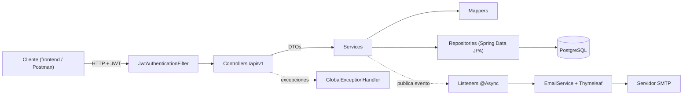

# TurnoYa: Gestión Inteligente de Turnos y Triage para Postas y Centros de Salud

**Curso:** CS 2031 Desarrollo Basado en Plataforma (2026-2)

**Integrantes:**

| Integrante | Rol |
|---|---|
| Leyrin Bridneys Aguilar Jorge | UI/UX & Frontend |
| Julian Edison Alvarez Cartolin | Fullstack & Integration |
| Johan Yadir Huayta Enriquez | Backend & Database Architecture |
| Dervy Pillaca Pullo | Backend & Async Processing |
| Adrián Jesús Ángel Veliz Quispe | DevOps, Testing & Cloud |

**Deploy:** [Completar: URL pública del backend]

---

## Índice

1. [Introducción](#introducción)
2. [Identificación del problema](#identificación-del-problema)
3. [Descripción de la solución](#descripción-de-la-solución)
4. [Arquitectura y decisiones de diseño](#arquitectura-y-decisiones-de-diseño)
5. [Modelo de entidades](#modelo-de-entidades)
6. [Manejo de errores](#manejo-de-errores)
7. [Medidas de seguridad](#medidas-de-seguridad)
8. [Eventos y asincronía](#eventos-y-asincronía)
9. [GitHub y gestión del proyecto](#github-y-gestión-del-proyecto)
10. [Ejecución local](#ejecución-local)
11. [Conclusión](#conclusión)
12. [Apéndices](#apéndices)

---

## Introducción

### Contexto

En las postas y centros de salud del Perú, los pacientes suelen hacer fila sin saber cuánto van a esperar. El orden de atención depende casi siempre de la hora de llegada, de modo que un caso urgente puede esperar lo mismo que uno leve.

### Objetivos

- Permitir que el paciente reserve un turno por centro y especialidad desde su celular.
- Registrar un triage rápido de síntomas al llegar y calcular automáticamente su nivel de urgencia.
- Ordenar la cola de atención por prioridad clínica y luego por hora de reserva.
- Notificar al paciente por correo cada cambio importante de su turno.
- Ofrecer una API REST segura, con roles diferenciados para paciente, médico y administrador.

## Identificación del problema

### Descripción

Hoy la espera en una posta es opaca: el paciente no conoce su posición ni el tiempo aproximado de atención. El personal tampoco cuenta con una herramienta simple para priorizar a quien llega con dolor de pecho frente a quien llega con un resfrío.

### Justificación

Priorizar por urgencia reduce el riesgo de que un caso grave se complique en la sala de espera. Además, reservar en línea evita aglomeraciones y ayuda al centro a no superar su capacidad diaria.

## Descripción de la solución

### Funcionalidades implementadas

| Funcionalidad | Cómo ayuda |
|---|---|
| Registro y login con JWT | Cada paciente tiene su cuenta; médicos y administradores tienen permisos distintos. |
| Catálogo de centros y especialidades | El administrador registra los centros con su ubicación, capacidad diaria y especialidades. |
| Búsqueda de centros cercanos | Ordena los centros por distancia a partir de latitud y longitud (fórmula de Haversine). |
| Reserva de turnos | Valida que el centro atienda la especialidad, que queden cupos ese día y que el paciente no tenga otro turno activo. |
| Triage | El paciente elige sus síntomas y el sistema calcula el nivel de urgencia (BAJO, MEDIO, ALTO o CRITICO). |
| Cola por prioridad | El médico ve la cola ordenada y llama al siguiente; el paciente consulta su posición. |
| Notificaciones por correo | Correos HTML de bienvenida, confirmación y cambios de turno, y resultado del triage. |

El nivel de urgencia se calcula con el síntoma más grave (de 1 a 4). Si el paciente reporta tres o más síntomas moderados, el nivel sube un grado.

### Tecnologías utilizadas

| Área | Tecnología |
|---|---|
| Lenguaje | Java 21 |
| Framework | Spring Boot 4.1.1 (Web MVC, Data JPA, Validation, Mail, Thymeleaf) |
| Seguridad | Spring Security 7, JJWT 0.12.6, BCrypt |
| Persistencia | Hibernate 7, PostgreSQL (producción), H2 en memoria (tests) |
| Utilidades | Lombok, Maven Wrapper |
| Pruebas | JUnit 5, Spring Boot Test |
| Herramientas | Git, GitHub, GitHub Actions, Postman, IntelliJ IDEA |
| Servicio externo | Servidor SMTP para correos (por ejemplo, Gmail) |

### Endpoints principales

Todas las rutas usan el prefijo `/api/v1`. La colección `postman_collection.json` en la raíz documenta los 37 requests con ejemplos de respuesta.

| Método y ruta | Rol |
|---|---|
| `POST /auth/register`, `POST /auth/login`, `POST /auth/refresh` | Público |
| `GET /usuarios/me` | Autenticado |
| `GET /especialidades`, `GET /centros`, `GET /centros/cercanos` | Público |
| `POST, PUT, DELETE /especialidades`, `POST, PUT, DELETE /centros` | ADMINISTRADOR |
| `POST /medicos` | ADMINISTRADOR |
| `GET, PATCH /pacientes/me` | PACIENTE |
| `POST /turnos`, `GET /turnos/me`, `PATCH /turnos/{id}/cancelar` | PACIENTE |
| `POST /turnos/{id}/triage`, `GET /turnos/{id}/posicion` | PACIENTE |
| `GET /centros/{id}/especialidades/{id}/cola` | MEDICO, ADMINISTRADOR |
| `POST /centros/{id}/especialidades/{id}/cola/siguiente` | MEDICO |
| `PATCH /turnos/{id}/estado` | MEDICO, ADMINISTRADOR |

## Arquitectura y decisiones de diseño

### Arquitectura



La API sigue una arquitectura en capas: el filtro JWT identifica al usuario, el controlador valida el DTO, el servicio aplica las reglas de negocio y el repositorio accede a la base de datos. Los correos salen del flujo principal mediante eventos.

### Decisiones de diseño

- **Servicios con interfaz e implementación:** los controladores dependen de la interfaz, lo que facilita las pruebas.
- **DTOs (records) y mappers manuales:** la API nunca devuelve entidades, así no expone datos sensibles ni genera ciclos de serialización.
- **`open-in-view=false` y `JOIN FETCH`:** los servicios convierten a DTO dentro de la transacción, y la cola trae paciente y usuario en una sola consulta, evitando el problema N+1.
- **Prioridad guardada en el turno:** el triage copia su nivel de urgencia al turno, así la cola sale de una sola consulta ordenada sin recalcular nada.
- **Síntomas como enum con gravedad:** la regla de urgencia vive en una sola clase (`CalculadoraUrgencia`), fácil de probar y ajustar.
- **JWT con refresh token:** sin sesiones en el servidor, la API puede escalar; el access token corto limita el daño si se filtra.
- **Nombres del dominio en español:** entidades y reglas usan los términos del personal de salud peruano (turno, triage, colegiatura); los elementos técnicos siguen las convenciones de Spring en inglés (`Controller`, `Service`, `Repository`, `Exception`).

## Modelo de entidades

```mermaid
erDiagram
    USUARIO ||--o| PACIENTE : "es"
    USUARIO ||--o| PERSONAL_SALUD : "es"
    USUARIO ||--o{ NOTIFICACION : "recibe"
    PACIENTE ||--o{ TURNO : "reserva"
    PERSONAL_SALUD |o--o{ TURNO : "atiende"
    CENTRO_SALUD ||--o{ TURNO : "recibe"
    ESPECIALIDAD ||--o{ TURNO : "corresponde"
    TURNO ||--o| TRIAGE : "tiene"
    PERSONAL_SALUD }o--o{ ESPECIALIDAD : "medico_especialidad"
    CENTRO_SALUD }o--o{ ESPECIALIDAD : "centro_especialidad"

    USUARIO {
        Long id PK
        String nombre
        String email UK
        String password_hash
        String telefono
        RolUsuario rol
    }
    PACIENTE {
        Long id PK
        Long usuario_id FK
        String dni UK
        LocalDate fecha_nacimiento
    }
    PERSONAL_SALUD {
        Long id PK
        Long usuario_id FK
        String colegiatura UK
    }
    CENTRO_SALUD {
        Long id PK
        String nombre
        String direccion
        Double latitud
        Double longitud
        Integer capacidad_diaria
    }
    ESPECIALIDAD {
        Long id PK
        String nombre UK
        String descripcion
    }
    TURNO {
        Long id PK
        Long paciente_id FK
        Long medico_id FK
        Long centro_id FK
        Long especialidad_id FK
        LocalDateTime fecha_hora
        EstadoTurno estado
        Integer prioridad
    }
    TRIAGE {
        Long id PK
        Long turno_id FK
        String sintomas
        NivelUrgencia nivel_urgencia
        LocalDateTime fecha_registro
    }
    NOTIFICACION {
        Long id PK
        Long usuario_id FK
        String mensaje
        String tipo
        LocalDateTime fecha_envio
    }
```



### Descripción de las entidades

- **Usuario:** base de autenticación para los tres roles (`PACIENTE`, `MEDICO`, `ADMINISTRADOR`). El email es único y la contraseña se guarda cifrada.
- **Paciente** y **PersonalSalud** (médico): perfiles unidos a un usuario mediante `@OneToOne` con `cascade = ALL`, de modo que al guardar el perfil también se guarda su usuario.
- **CentroSalud** y **Especialidad:** se relacionan N:M mediante la tabla `centro_especialidad`. El médico también se relaciona N:M con sus especialidades (`medico_especialidad`).
- **Turno:** entidad central, con relaciones `@ManyToOne` en `LAZY` hacia paciente, médico, centro y especialidad. Su estado avanza entre `RESERVADO`, `EN_ESPERA`, `EN_ATENCION`, `ATENDIDO` y `CANCELADO`, y un índice por centro, especialidad y estado acelera la cola.
- **Triage:** relación 1:1 con el turno. Guarda los síntomas y el nivel de urgencia calculado.
- **Notificacion:** historial de cada correo enviado a un usuario.

Las restricciones se aplican en dos niveles: en la base de datos (`nullable = false`, `unique`, longitudes e índices) y en la aplicación, con Bean Validation en los DTOs (`@NotBlank`, `@Email`, `@Pattern`, `@Past`, `@Min`).

## Manejo de errores

Todas las excepciones propias extienden de `ApiException`, que guarda el código HTTP correspondiente:

| Excepción | HTTP |
|---|---|
| `ResourceNotFoundException` | 404 |
| `DuplicateResourceException`, `TurnoConflictException` | 409 |
| `CentroSinCapacidadException`, `InvalidTriageLevelException`, `InvalidOperationException` | 400 |
| `InvalidCredentialsException`, `TokenExpiredException` | 401 |
| `ForbiddenException` | 403 |
| `NotificationFailedException` | 500 |

`GlobalExceptionHandler` (`@RestControllerAdvice`) también atiende las excepciones de Spring: validación de DTOs, JSON mal formado, parámetros inválidos (400), falta de autenticación (401), falta de permisos (403), ruta inexistente (404), método no permitido (405) e integridad de datos (409). Cualquier otro error devuelve 500 sin exponer detalles internos. Todas las respuestas tienen el mismo formato:

```json
{
  "timestamp": "2026-09-25T10:15:30",
  "status": 404,
  "error": "Not Found",
  "message": "No se encontró el turno con id 45",
  "path": "/api/v1/turnos/45"
}
```

Manejar los errores de forma global evita repetir `try/catch` en cada controlador y garantiza que el frontend reciba siempre una respuesta clara y predecible.

## Medidas de seguridad

### Seguridad de datos

- **Autenticación sin estado con JWT.** El login devuelve un *access token* de 2 horas y un *refresh token* de 7 días. El token incluye `userId`, `email` y `rol`. `JwtAuthenticationFilter` lo valida en cada petición y carga el usuario con un `UserDetailsService` propio.
- **Contraseñas cifradas con BCrypt.** Además se exige una contraseña fuerte: de 8 a 64 caracteres, con mayúscula, minúscula y número.
- **Autorización por roles.** Se usa `@PreAuthorize` en los controladores. Los servicios además verifican la propiedad del recurso: un paciente solo puede ver, cancelar o registrar triage de sus propios turnos (`ForbiddenException`).
- **Secretos fuera del código.** La clave JWT, las credenciales de la base de datos, el correo y el administrador inicial se leen de variables de entorno.

### Prevención de vulnerabilidades

- **Inyección SQL:** todas las consultas usan Spring Data JPA con parámetros enlazados; nunca se concatenan cadenas SQL.
- **XSS:** la API solo responde JSON, y las plantillas de correo usan `th:text`, que escapa el contenido automáticamente.
- **CSRF:** está desactivado porque la API es *stateless* y no usa cookies de sesión; el token viaja en la cabecera `Authorization`.
- **CORS:** solo se aceptan los orígenes configurados en `CORS_ALLOWED_ORIGINS`.
- **Validación de entrada:** todos los DTOs usan Bean Validation, y los datos inválidos se rechazan con 400 antes de llegar a la lógica de negocio.

## Eventos y asincronía

| Evento | Se publica cuando | Qué hace el listener |
|---|---|---|
| `UsuarioRegistradoEvent` | Se registra un paciente o se crea un médico | Envía el correo de bienvenida |
| `TurnoEvent` | Se reserva un turno o cambia su estado | Envía la confirmación o actualización del turno |
| `TriageRegistradoEvent` | El paciente registra su triage | Recalcula la cola y le envía su nivel de urgencia y posición |

Los listeners usan `@TransactionalEventListener(phase = AFTER_COMMIT)`, así que solo actúan cuando los datos ya se guardaron y nunca notifican un turno que terminó en *rollback*. Además usan `@Async`, con un `ThreadPoolTaskExecutor` propio (4 a 10 hilos y cola de 100 tareas).

**¿Por qué asíncronos?** Enviar un correo por SMTP puede tardar varios segundos o fallar. Si se hiciera dentro de la petición, el paciente esperaría más para confirmar su turno y un fallo del servidor de correo rompería la reserva. En segundo plano, la API responde al instante, y si el envío falla solo se registra en los logs. Cada correo enviado queda guardado en `Notificacion`.

## GitHub y gestión del proyecto

- **Flujo de ramas:** cada integrante trabajó en una rama `feature/<nombre>-<tema>` y abrió un Pull Request hacia `master`. La rama `master` está protegida: no acepta *push* directo y requiere la aprobación de otro integrante.
- **Mensajes de commit descriptivos**, en su mayoría con el formato *Conventional Commits* (`feat`, `docs`, `build`).
- **GitHub Projects:** [Completar: enlace al tablero, cómo se crearon los issues, a quién se asignó cada uno y las fechas límite].
- **GitHub Actions:** el flujo `.github/workflows/ci.yml` se ejecuta en cada *push* y en cada Pull Request hacia `master`. Instala Java 21, compila el proyecto y corre los tests; si algo falla, el PR queda marcado en rojo antes de fusionarse.

## Ejecución local

**Requisitos:** Java 21 o superior y PostgreSQL con una base de datos llamada `turnoya`.

```bash
git clone https://github.com/pikachu-programador/backend_TurnoYa_oficial.git
cd backend_TurnoYa_oficial
./mvnw spring-boot:run   # levanta la API en http://localhost:8080
./mvnw clean test        # corre los tests con H2 en memoria
```

En Windows se usa `.\mvnw.cmd` en lugar de `./mvnw`.

Al arrancar se crean automáticamente un administrador y cuatro especialidades base.

| Variable de entorno | Uso | Valor por defecto |
|---|---|---|
| `DB_HOST`, `DB_PORT`, `DB_NAME` | Conexión a PostgreSQL | `localhost`, `5432`, `turnoya` |
| `DB_USERNAME`, `DB_PASSWORD` | Credenciales de la base de datos | `postgres` |
| `JWT_SECRET` | Clave de firma JWT (mínimo 32 caracteres) | Clave de desarrollo |
| `ADMIN_EMAIL`, `ADMIN_PASSWORD` | Administrador inicial | `admin@turnoya.com` |
| `MAIL_USERNAME`, `MAIL_PASSWORD` | Cuenta SMTP para correos | Vacío |
| `CORS_ALLOWED_ORIGINS` | Orígenes permitidos del frontend | `http://localhost:5173` y `http://localhost:3000` |

## Conclusión

### Logros

TurnoYa cubre el flujo completo de una atención: registro, búsqueda del centro, reserva con control de cupos, triage con cálculo de urgencia, cola por prioridad y notificaciones por correo, todo protegido con JWT y roles.

### Aprendizajes clave

- Diseñar relaciones JPA pensando en rendimiento: `LAZY`, índices y consultas con `JOIN FETCH`.
- Configurar Spring Security sin estado con JWT y refresh tokens.
- Usar eventos y asincronía para desacoplar tareas lentas, como el envío de correos, de la respuesta HTTP.
- Trabajar en equipo con ramas, Pull Requests y revisiones de código.

### Trabajo futuro

- Actualizar la cola en tiempo real con WebSockets.
- Integrar Google Maps y notificaciones SMS o push.
- Estimar el tiempo de espera y generar estadísticas por establecimiento.
- Agregar paginación, documentación Swagger/OpenAPI y más pruebas de integración.

## Apéndices

### Licencia

Este proyecto se distribuye bajo la licencia MIT (ver archivo `LICENSE`).

### Referencias

- Spring Boot Reference Documentation: https://docs.spring.io/spring-boot/
- Spring Security Reference: https://docs.spring.io/spring-security/reference/
- Spring Data JPA Reference: https://docs.spring.io/spring-data/jpa/reference/
- JJWT (Java JWT): https://github.com/jwtk/jjwt
- Thymeleaf Documentation: https://www.thymeleaf.org/documentation.html
- GitHub Actions Documentation: https://docs.github.com/actions
